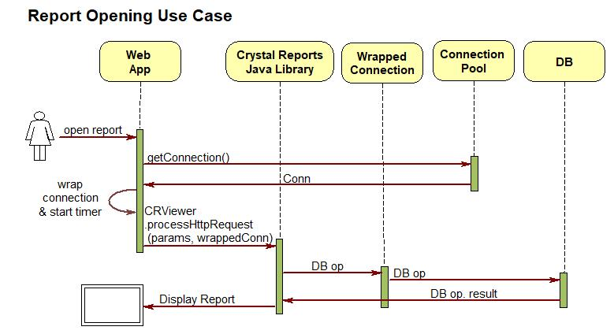
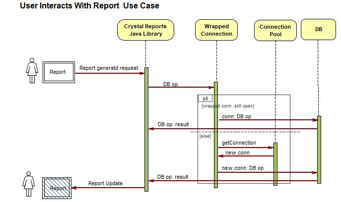

## Pooled JDBC Connection auto-closing wrapper

The use of this class is to work-around a problem caused by Crystal Reports Java libraries not considering the possibility of being used in a pooled connection environment, as is the usual case in web applications. 

Use at your own discretion. It worked for my company's use case. 

### The problem

CR keeps requested JDBC connections open while user works with reports, which is a bad practice for pooled connections, as mostly used in web applications. 

CR provides a callback to notify application when user closes the report window, however it is not uncommon for users to leave reports open, in which case connection would never be returned to the pool.

Even if the user would close the report when finishing its interaction with it,  user interaction time is too long to hold a scarce resource as a JDBC connection.

Best practice for JDBC pooled connections is to "close" them immediately after use, as that action  doesn't really close but returns them to the available pool, which will hand them (still opened) on new connection open requests.

### The Workaround Solution

This class provides a workaround for the problem, by wrapping the connection provided to CR with code which automatically closes it after a defined (short, user defined) timeout, and which reopens it on subsequent use, in case connection were already closed.

The initial DB interaction takes place while wrapped connection is still open, so wrapper uses its wrapped connection to execute the requested DB operation(s).

For subsequent requests, wrapper checks if wrapped connection was closed (by its defined timeout expiration), in which case it opens a new one (which only gets a pre-opened connection from the pool), wraps this new connection, sets the auto-closing timer, and performs the DB operation using this new connection. Delay between operations doesn't matter. A new operation hours later on an opened report, still work, while connections were not retained out of the pool.

### The Proper Solution

The proper way of solving this problem would be to implement a parameter in the library, where applications could indicate when they use pooled connections, in which case the library would close them immediately after every use, "opening" (requesting one from the pool, actually)  a new one for each subsequent interaction. Of course, login operation would not be required because it is handled by the connection pool classes when initializing the pool at application setup time (usually through JNDI).

